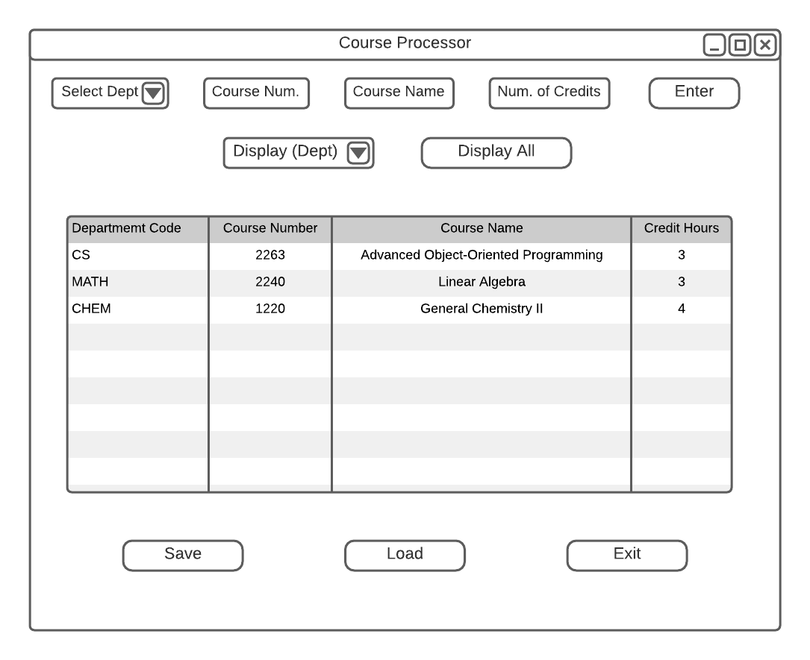
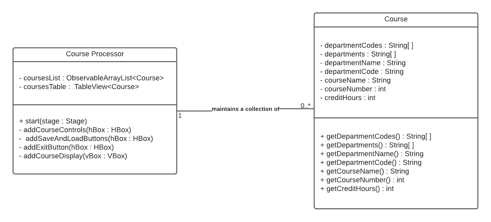

# CS 2263 Homework 03 Version 0.1.0

## Project Description
This is a simple UI project that allows a user to input information about a course and then display 
that information to the screen when prompted by the user.

## Documentation
Documentation can be found at the following link: [documentation](javadoc/index.html)

## Design
### User Interface Mockup
  
The above image depicts a simple mockup of what the user-interface will look like. The user
will be able either input courses manually or load them from a JSON file. They also have
multiple options for displaying the courses as well as having the option to save the current
catalog of courses.
### UML Class Diagram

The above image depicts the relationship between the Course Processor class (which
houses the UI) and the Course data class. The Course Processor class maintains a list of courses input
or loaded by the user. 

## How to Install and Run
To install and run this project, you must have both Java and Gradle installed on your local
system. To install, clone this repository to your computer. To run, you first must make sure
that you are in the directory that you just cloned. Then, on the command line enter the following
text: ``gradle run`` 

## How to Use
Once the project is running, you should see a window with three buttons in it.
To add courses, click on the add courses button which will open a drop-down menu with a
choice of six departments. Once you select the department you want, a prompt will open
asking you to enter the course number, name, and credit hours. Enter the information and
hit enter. To see courses, click on the show courses button, which will open a drop-down
menu with the options to see all courses or to only see course within a specified department.
To exit, either press the 'X' in the top right corner of the window or click the exit button.
Clicking the exit button will open a prompt asking if you are sure you want to leave. To exit
hit yes.
